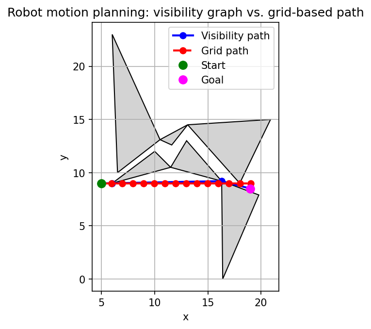
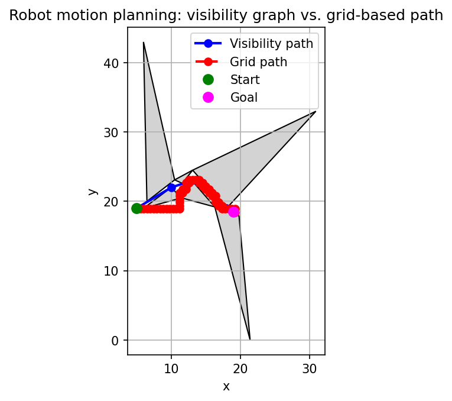
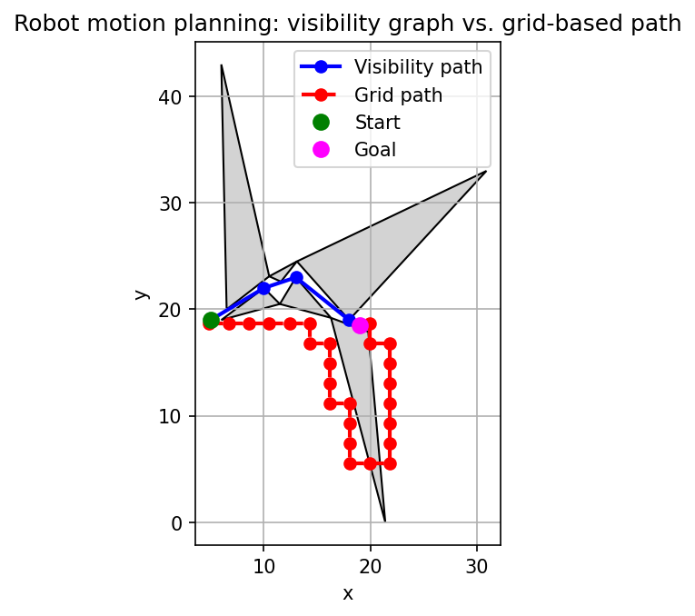
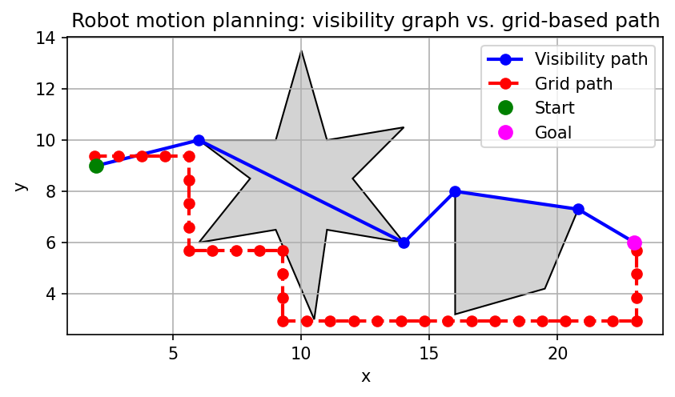
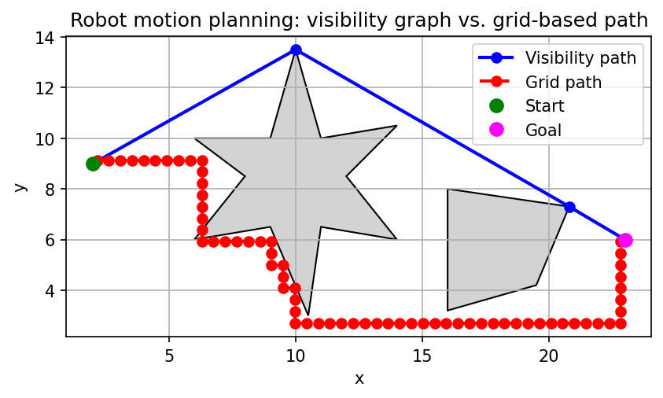
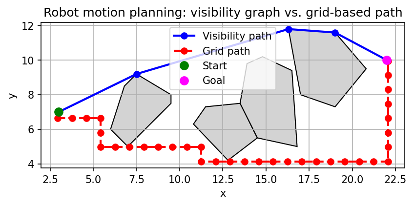
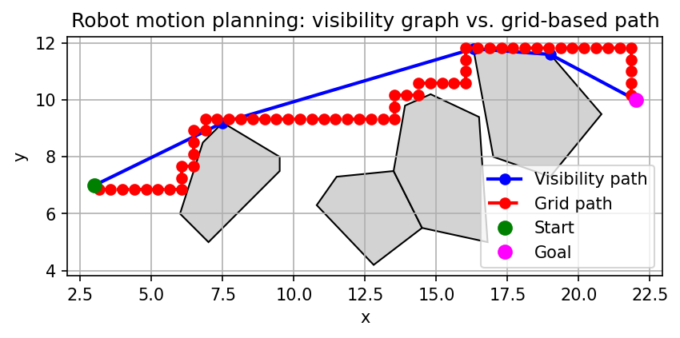
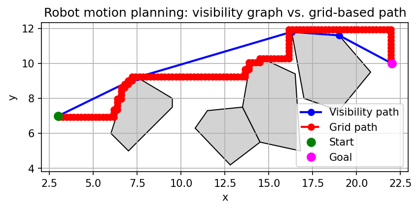

# Robot Motion Planning: Design, Complexity, and Behavior

Comparing an **exact geometric method** vs. a **discretization-based planner**, with explicit complexity and accuracy trade-offs.

---
## Table of contents


---

## High-Level Structure

We compare two approaches for planning a path from a start point to a goal point in a polygonal environment with obstacles:

- **Exact planner**: Visibility graph + Dijkstra
- **Approximate planner**: Uniform grid + BFS

Pipeline:

1. Read or construct a `Problem` (environment + start + goal)
2. Run both planners via `Runner`
3. Collect results in `PlanningResult`
4. Produce:
   - TikZ/LaTeX (+ optional PDF)
   - Optional Matplotlib PNG
   - Optional detailed numeric report

---

## Complexity

Let
- `n_v` = number of obstacle vertices + start + goal
- `E_obs` = number of obstacle edges (≈ `n_v` for simple polygons)
- `G = grid_size²` = number of grid cells

### Visibility Graph Planner

**Graph construction**

- Pairs of vertices: Θ(`n_v²`)
- For each pair, `segment_hits_obstacle` checks all obstacle edges: O(`E_obs`)
- Total complexity: **O(n_v² · E_obs)** ≈ **O(n_v³)** when `E_obs = Θ(n_v)`

Memory:

- Vertices: O(`n_v`)
- Adjacency list: up to O(`n_v²`) edges in dense cases

**Shortest path (Dijkstra)**

- Complexity: **O((n_v + m_vg) log n_v)** with binary heap
- In a dense visibility graph (`m_vg = Θ(n_v²)`): **O(n_v² log n_v)**
- In practice, graph construction cost typically dominates for moderate sizes.

### Grid-Based Planner

**Bounding square**

- Single pass over all vertices and start/goal: **O(n_v)**

**Cell classification**

- For each of `G` cells:
  - Call `point_in_any_obstacle` → O(`n_v`)
- Total: **O(G · n_v)**

**BFS on the grid**

- Nodes: `G` cells
- Edges: O(`G`) (each cell has at most 4 neighbors)
- BFS: **O(G)**

Memory:

- Grid: O(`G`)
- BFS structures (`visited`, `parent`): O(`G`)

In practice:

- For small `n_v` and large `grid_size`, the grid part dominates runtime.
- For large `n_v`, the visibility graph construction dominates.

---

## Design Choices

### Two Planners Exact vs Approximate

- **Visibility graph**:
  - Classical exact solution for shortest paths around polygons.
  - For optimistic environments (no degenerate vertex contacts and well-oriented polygons) the output is a high quality approximation to the true shortest path.
  - Cubic worst-case complexity in this implementation.

- **Uniform grid + BFS**:
  - Close to occupancy-grid planning used in robotics.
  - Path quality and correctness depend strongly on `grid_size`.
  - BFS guarantees minimal number of grid steps, not Euclidean shortest path.
  - Path can widely differ due to reduced directionality

### Uniform Grid instead of Full Quadtree

- The grid corresponds to a full quadtree of fixed depth, but is stored as a 2D list of `GridCell`.
- This keeps the implementation compact while still allowing the grid to be interpreted as a uniform quadtree:
  - Leaves of a full quadtree can be indexed as `(i, j)` cells.

### Bounding Square and Margin

- The grid overlays a **square** that contains:
  - All obstacle vertices
  - Start and goal

- `margin_ratio` defines how much extra space is added around the environment:
  - Reduces clipping at boundaries.
  - Helps keep start/goal and obstacles away from the grid border.

### Discrete Free Space via Cell Centers

- Each cell is classified solely by its **center**:
  - Center inside or on an obstacle → cell is **blocked**
  - Center in free space → cell is **free**

- The grid path is a polyline of cell centers.

This approach leads to some quirks/problems:
- Very thin obstacles or narrow gaps may be lost when the grid is coarse.
- A path may appear to “graze” an obstacle or cut a corner when only a few cells are available across a corridor.

### Visibility Conditions

The visibility test `segment_hits_obstacle(p, q, env)` is responsible for deciding whether a straight-line edge between `p` and `q` is allowed in the visibility graph.

- Intersections are found using `segments_intersect`.

- Three kinds of contacts are distinguished:

  1. **Proper crossings / edge-interior intersections**
     - If the segment crosses an obstacle edge at a non-endpoint of `pq`, the edge is **blocked**.

  2. **Touches at a vertex (endpoint of `pq`)**
     - If the intersection is at `p` or `q`, we analyze that obstacle vertex:

       - If the vertex belongs to **multiple obstacles** (shared vertex), it is treated as a **blocking** contact.
         - This prevents paths from squeezing through single-point contacts between polygons.
         
         
         
       - If the vertex is **concave** for that polygon:
         - Touching it is considered **blocking**.
         - This avoids the “jump” effect, when the graph connects to a vertice while going through the pocket of a concave polygon.
         
         
         
       - If the vertex is **convex** and belongs to exactly one obstacle:
         - Touching it is **allowed**.

  3. **Sliding along a single obstacle edge**
     - If the whole segment `pq` exactly coincides with one obstacle edge (possibly reversed), this is treated as **allowed** visibility.
       - This permits paths that run along polygon edges.

- Net effect:
  - Visibility edges may:
    - Start/end at convex vertices of a single polygon,
    - Slide along edges of a single polygon,
    - Connect vertices as long as they do not cross obstacle interiors.

  - Visibility edges are forbidden from:
    - Passing through shared vertices where two polygons touch,
    - Using concave vertices as portals, which previously caused unrealistic shortcuts in U-shaped obstacles.

These rules are tuned for **point robots** and environments where single-point polygon contacts should be treated as blocked.

---

## What Happens During a Run

### Input stage
   - Either parse a file with `START`, `GOAL`, and `OBSTACLE` blocks, or construct a built-in demo environment.

Input format (pseudo BNF)
```
file           ::= { comment | start | goal | obstacle | blank }*
comment        ::= '#' <rest of line>
blank          ::= <empty line> | whitespace-only line
start          ::= 'START' x y
goal           ::= 'GOAL'  x y
obstacle       ::= 'OBSTACLE' newline vertex+ newline 'END'
vertex         ::= x y
```
where x and y are floating-point numbers.

   - Validate start/goal.
     - `start != goal`
     - `start` and `goal` are not inside (or on) any obstacle.
   - Expand by `margin_ratio` on each side.

### Exact Planning Stage (Visibility Graph)

_Algorithm_

1. Collect all obstacle vertices + start + goal into a list `vertices`.
2. For each pair `(i, j)` of vertices with `i < j`:
   - Let `p = vertices[i]`, `q = vertices[j]`.
   - Test `segment_hits_obstacle(p, q, env)`:
     - If it returns **False**, the segment is considered visible.
       - Add an undirected edge `i ↔ j` with weight equal to Euclidean distance.
3. Identify the indices `s` and `t` corresponding to start and goal.
4. Run Dijkstra’s algorithm from `s`:
     - Initialize `dist[s] = 0`, all others `∞`.
     - Repeatedly extract the vertex with smallest tentative distance.
     - Relax edges to its neighbors.
     - Stop early if `t` is popped from the priority queue.
5. Check `dist[t]
   - If finite:
     - Reconstruct the path by following predecessors back from `t` to `s`.
     - Convert vertex indices back to `Point`s.
   - If infinite:
     - Visibility graph has no path from start to goal.

The resulting path is a polyline that goes through a subset of obstacle vertices while respecting the visibility rules above.

### Grid Planning Stage (Uniform Grid + BFS)

_Algorithm_

1. Compute a bounding square around:
   - All obstacle vertices,
   - Start and goal,
   - Expanded by `margin_ratio` on each side.
2. Derive `cell_size = side_length / grid_size`.
3. For each pair of grid indices `(i, j)`:
   - Compute the world-space center of the cell.
   - Test whether this point is inside/on any obstacle polygon:
     - If yes → `GridCell.blocked = True`
     - If no → `GridCell.blocked = False`
4. Map start and goal to their containing cells via `(x, y) → (i, j)`:
   - Clamp indices into `[0, grid_size - 1]`.
   - If either mapped cell is blocked → “no path” for this resolution.
5. Otherwise, perform BFS:
   - Initialize `queue = [start_cell]`, `visited = {start_cell}`.
   - While `queue` not empty:
     - Pop the front cell `(i, j)`.
     - If `(i, j)` is the goal cell, stop and reconstruct the path.
     - For each 4-neighbor `(ni, nj)` (up, down, left, right):
       - Skip neighbors outside the grid.
       - Skip neighbors whose cell is blocked.
       - If not visited, mark visited, record parent, and push to queue.
6. Check whether BFS reaches the goal:
   - If yes:
     - Recover the sequence of cells from goal back to start via the parent map.
     - Reverse it and convert each cell index to its center point. ű

    
### Output Stage

Depending on configuration:
- Generate TikZ code for:
  - Obstacles (gray polygons)
  - Visibility path (blue polyline, if any)
  - Grid path (red dashed polyline, if any)
  - Start (green circle) and goal (magenta circle)
- Optionally run `pdflatex` on the `.tex` file.
- Optionally build a Matplotlib figure and save to PNG.
- Optionally print a numeric report:
  - Environment statistics,
  - Visibility-graph statistics,
  - Exact path length and vertex sequence (if any),
  - Grid path length and cell-center sequence (if any),
  - Approx/exact length ratio (if both paths exist).

---

## Sources of Inaccuracy and Incorrect Output

Even with exact geometry routines, the planners can produce results that are not the mathematically exact shortest path or are slightly misleading in some environments.

1. **Design choices in visibility rules**
   - Concave vertices and shared vertices are treated as **blocking** when touched.

2. **Grid discretization**
   - The grid planner only sees free/blocked at cell centers:
     - Narrow passages smaller than `cell_size` may disappear entirely.
     - A path may appear to cut across the exact location of an obstacle vertex or graze a polygon corner when the grid is coarse.
   - The grid path is guaranteed only to be valid in the **discretized** world, not in the exact continuous geometry.

    

3. **Floating-point robustness**
   - All geometric predicates rely on floating-point computations with a small epsilon:
     - Points very close to an edge may be classified inconsistently as inside or outside.
     - Extremely thin or nearly collinear features are sensitive to numerical rounding.

Visibility planner is **intentionally conservative** in degenerate configurations (single-point contacts, U-turns).

---

## Special Cases, Edge Cases, and Failures

### Cases Explicitly Handled

1. **Invalid start/goal**
  - `start == goal` → rejected before planning.
  - Start or goal inside or on any obstacle → rejected as invalid.

2. **Degenerate bounding boxes**
  - If all geometry collapses to a point or line:
    - The bounding square is enforced to have at least side length `1.0`,
    - Prevents division by zero in grid construction.

3. **Single-point contacts between obstacles (visibility graph)**
  - If a vertex belongs to multiple obstacles, touching it is treated as a collision:
    - The visibility planner will not create edges that use such a vertex as a portal.
    - This avoids paths squeezing through zero-area gaps.

4. **Concave corners (visibility graph)**
  - Touching a concave vertex is also treated as a collision:
    - Prevents paths from cutting across U-shaped obstacles by bouncing off the inner corner.
    - Instead, the path must go around one of the “arms” of the U.

### Cases Intentionally Not Fully Resolved

These are not resolved due to time limit, or just to showcase the shortcomings of such approach.

1. **Single-point contacts and narrow gaps (grid planner)**
  - The grid planner still works purely on cell centers:
    - At certain resolutions, a narrow gap or a single-point contact can appear as open space.
    - The resulting BFS path may visually pass very close to or even through a vertex where two polygons meet.


2. **Very thin obstacles / features smaller than `cell_size`**
  - Such obstacles can be entirely missed by the grid if no cell center falls inside them.
  - The visibility graph will see them correctly, but the grid-based path might ignore them.


3. **Robot with non-zero radius**
  - The model assumes a point robot:
    - A physical robot with thickness would need configuration-space obstacles inflated by the robot radius.

4. **Polygons with self-intersections**
  - Polygons are assumed simple:
    - Self-intersecting polygons can cause incorrect inside/outside and concavity decisions.
    - There is no automatic repair or pre-processing for such inputs.


### Problems not fixed

1. **Visibility graph going through concave polygons**

This problem appeared last minute, after fixing some other problems, and I had no time to debug and fix it.

Current version:

Older version:


---

## Subtle Points

### Epsilon (`EPS`)

- All collinearity and on-segment checks use an absolute tolerance `EPS = 1e-9`:
  - Reduce instability from rounding errors.
  - Points extremely close to collinear are treated as collinear.

This affects:
  - `orient`
  - `on_segment`
  - `segments_intersect`
  - Indirectly, concavity tests (since they use `orient`)

### Point-on-Boundary is “Inside”

- `point_in_polygon` returns `True` if the point lies **on** any polygon edge.
- Consequences:
  - Start/goal on an obstacle boundary are considered invalid.
  - Grid cells whose centers lie exactly on an obstacle edge are treated as blocked.

This avoids ambiguous paths that run exactly along obstacle boundaries in the grid world.

### Ray Casting with Half-Open Interval

In `point_in_polygon`:
- In `point_in_polygon`, for each edge `(a, b)` oriented so `a.y ≤ b.y`, the ray is tested only if `p.y ∈ [a.y, b.y)`:
  - Prevents double counting intersections at vertices.
  - Ensures a consistent even–odd rule for deciding inside vs outside.

### Segment-Against-Obstacle Edges

- `segments_intersect` detects:
  - Proper crossings
  - Endpoint touches
  - Collinear overlaps

- `segment_hits_obstacle` then classifies intersections:
  - Crossing in the interior of `pq` → blocking
  - Touch at an endpoint:
    - Shared or concave vertex → blocking
    - Convex vertex of a single obstacle → allowed
  - Segment exactly along a single obstacle edge → allowed

This layered logic is what enforces the special handling of shared and concave vertices described earlier.

### Polyline Length

- Both paths (visibility and grid) are compared via `polyline_length`:
  - This uses Euclidean norm on consecutive pairs of points.
  - The “approx / exact length ratio” in the report is computed as:
    `length(grid_path) / length(vg_path)` if `vg_path` exists.

Values near 1 indicate that, for that environment and grid resolution, the grid path is a good approximation of the visibility-graph shortest path.

---

## Results

- **Visibility path**:
  - Represents a shortest path in the visibility graph, consistent with the geometric and degeneracy rules chosen:
  - Straight-line segments between start, goal, and selected obstacle vertices.
  - Does not pass through interiors of obstacles.

- **Grid path**:
  - Represents a shortest path in terms of 4-connected grid steps on the discretized map.
  - Length is usually larger, sometimes significantly, depending on `grid_size` and obstacle layout.
  - Manhattan-style stepping on the grid.
  - Discretization error from finite resolution.
  - Small `grid_size` may find route that is not the shortest, larger `grid_size` can lead to significantly more calculations.





- **Length ratio**:
  - Values close to 1 → high-quality approximation for this environment and `grid_size`.
  - Larger values indicate either:
    - A coarse grid
    - Complex geometry poorly captured by uniform discretization.

