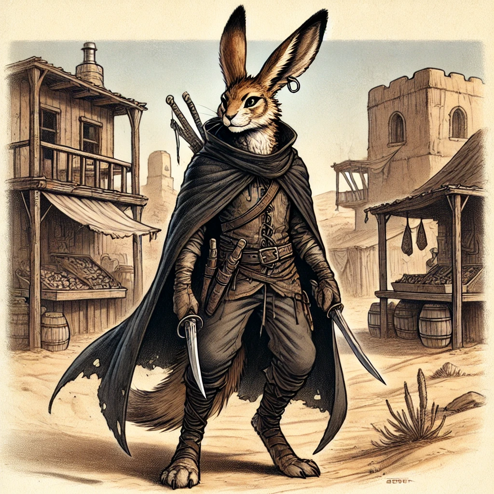
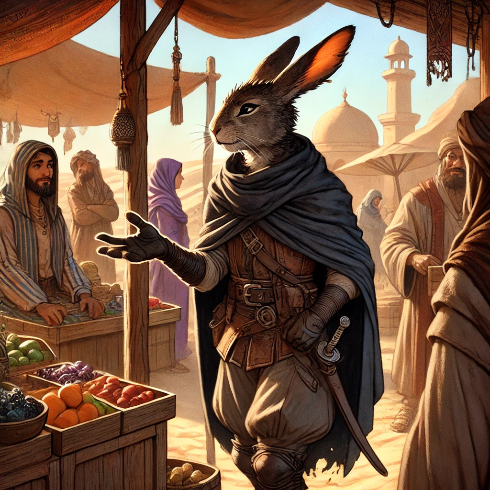
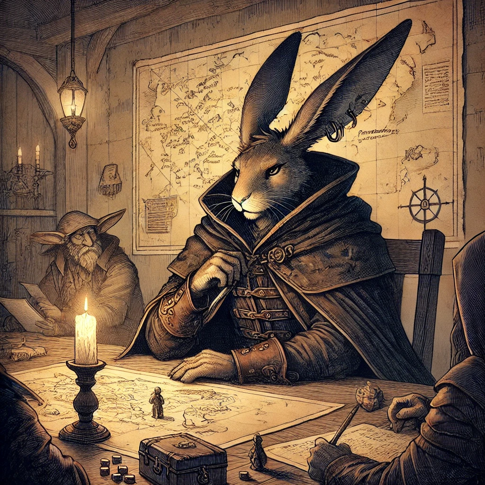
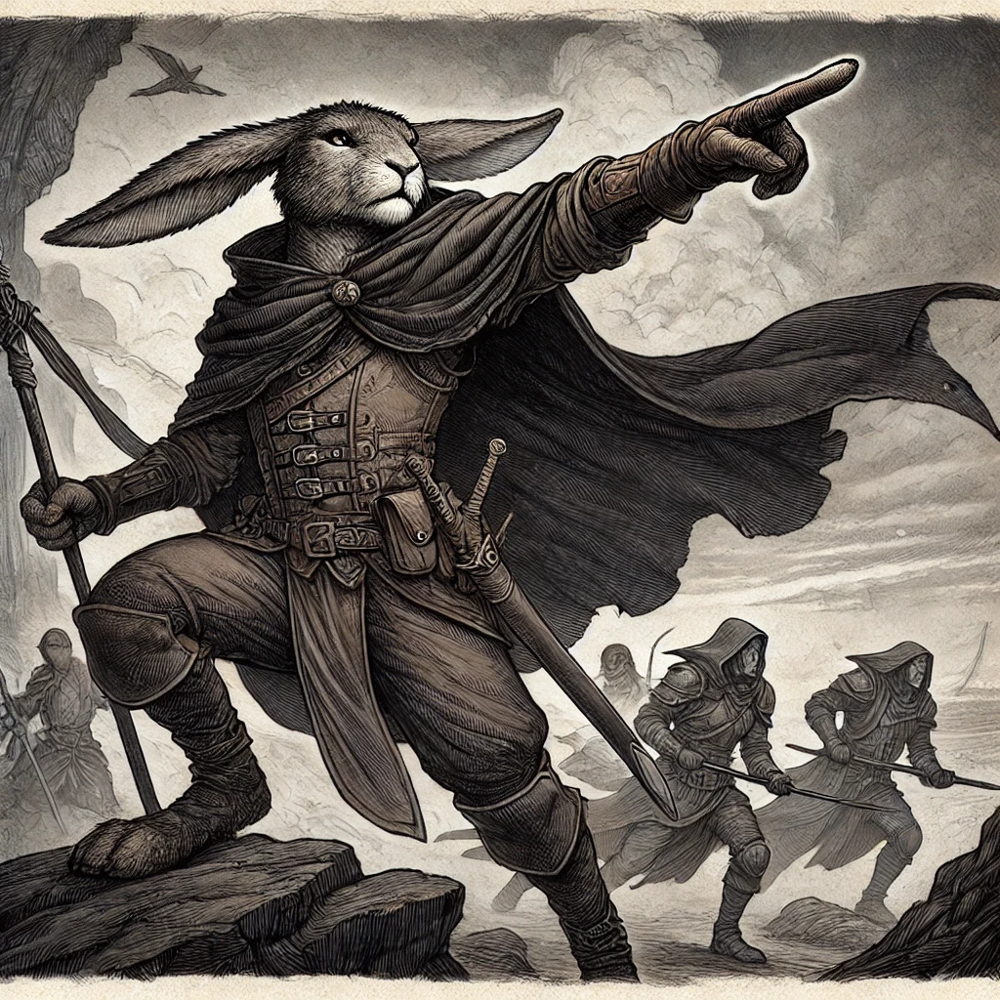

# Adhan Tawila
- [Outlander](https://5e.tools/backgrounds.html#outlander_phb)
- [Harengon](https://5e.tools/races.html#harengon_mpmm)
- [Mastermind Rouge](https://5e.tools/classes.html#rogue_xphb,state:isshowfluff=b1~sub-mastermind-xge=b1)

## Personality
- Personality Trait: I have a lesson for every situation, drawn from observing nature. 
- Ideal: Glory. I must earn glory in battle, for myself and my clan.
- Bond: I will bring terrible wrath down on the evildoers who destroyed my homeland. 
- Flaw: Violence is my answer to almost any challenge. 
- Alignment: Lawful Evil
## Backstory
### Korai élete

Adhan az Anaurochi Tawila klánba született, 1458 évben, a klánt vezető II. Teol és Kinicef gyermekeként, a klán házában a Desertsmouth hegység lábánál.
A klán fő bevétele a sivatag déli részén bellüli kereskedésből és a kereskedelmi útvonalak felügyeletéből származott, a területen jelentős politikai és pénzügyi befolyással rendelekezett.
A Tawila egy kisméretű, nem nemesi klán, stabil helyzete miatt Adhan bőségben és biztonságban nőtt fel.
Tanulmányai az általános ismereteken kívül a vezetésre és diplomáciára terjedtek ki, hogy felkészüljön a klán átvételére,
ezen fellül a klán kardmestere vívásra és párbajozásra tanította, főként rituális eseményekre, vagy önvédelemre, diplomáciai vezetőként nem állt volna abban a veszélyben, hogy csatában kelljen részt vennie.
### Tawila klán bukása

1475 év során a Tawila klán több karavánját, illetve több a klán által védett karavánt asabi támadás ért,
amire válaszul a klán több őrt állított a karavánok mellé, harcosokat küldött a sivatagba, hogy elűzzék az asabi törzseket a kereskedelni útvonalok környékéről,
és követeket küldött több d'tarig törzshöz, hogy segítségükre legyenek az asabik ellen. A klán házának védelme emiatt lecsökkent,
és egy egyesült asabi horda, a Tawila klán kiírtásának céljával lerohanta azt. Asabi kémek bellülről kinyotották a kaput, így a város ostrom nélkül elesett.
A küzdelemben a klán tagjainak nagy része, köztük Adhan szülei elestek, néhányuk szétszóródott a sivatagban. Az asabik átevették az uralmat a korábban Tawila kereskedelmi útvonalak felett.
Adhant a klán kém mestere juttatta ki a városból, titkos alagutakon keresztül, de néhány mérföldre a faltól asabi harcosok elfogták őket, a kémet megölték,
Adhant megkötözték, mivel nem voltak tisztában a ténnyel, hogy megölhetik-e a klán vezető tagjait vagy sem.
Egy, a Tawila klánnal szövetséges D'tarig törzs tagjai találtak rájuk, akik gyanakodtak  a nagyméretű asabi mozgolódásra és titkban követték a hordát.
Az asabik közti beszélgetésekből megtudták, hogy a Tawilák kiírtása a céljuk, és nem fognak túszokat ejteni.
Adhan fogvatartóit megölték, kiszabadították a fiatal Harengont és magukkal vitték a sivatagba.

Ez az esemény traumatikus pont Adhan életében, ami örökké kísérti, és a bosszúvágy teljesen felemészti őt.
Bár saját szemével nem látta, tudja hogy a szüleit és barátait megölték.
Egyetlen célja az asabik kiírtása, és klánjának helyreállítása, és ezért bármilyen árat képes megfizetni.
### Élete a sivatagban

A következő 6 évben Adhan a D'tarigokkal élt az Anauroch déli részén, eltanulta a sivatagi túlélés és D'tarig kémkedés titkait, a D'tarigok által kedvelt karddal való vívást és a sivatagi elementálok nyelvét.
Útonállóként többször rajtaütött asabi karavánokon, ezzel elnyerte a D'tarigok bizalmát, és a törzs teljes jogú tagja lett.
Bér Adhan soha nem tekintett a D'tarigokra többként mint egy eszköz amivel a céljait elérheti, néhány barátot azért szerzett köztük,
akik mielőtt elhagyta a sivatagot, hagyományos sivatagi hangszert ajándékoztak neki.

### Célja a szigeten

Célja, hogy a D'tarig törzseket egyesítse az asabik ellen, de mivel a D'tarigok gyanakvóak a kívülállókkal szemben, még akkor is ha egy másik D'tarig törzs tagjáról van szó, 
Adhannak jelentős névre kell szert tennie, és minden lehetőséget ki kell használnia célja elérése érdekében.
Ezért 1481 tavaszán elhagyta a sivatagot egy nyugat felől érkező szóbeszédet követve, és az év nyarán Neverwinterbe érkezett, egy kapitányt keresve aki elvinné Stormwreck szigetre, 
ahol Adhan a sziget mágiájával szeretné felfegyverezni magát, és a kalanddal a saját dicsőségét növelni.